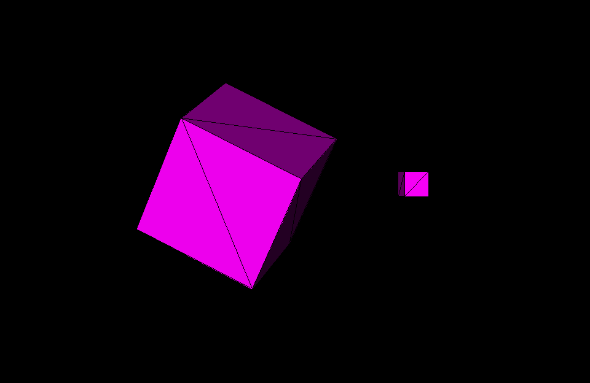

# Renderer

A 3D software renderer written in C using SDL3.



https://github.com/user-attachments/assets/613fea9e-5bca-4c8d-9490-1a8a89992a31

This project was made to fill my curiosity on the math behind 3D Rendering and to be a base for later projects. It consists of:  
- Software rendering (writing directly to a pixel buffer)
- Perspective projection
- 3D transformations (rotation, scaling, translation)
- Vector and matrix mathematics
- Some Shading and "Light"

Currently, it renders a rotating 3D cube. I will later try create Minecraft using this as a base. 

## Building and Running

1. **Build the project:**
   ```bash
   make
   ```

2. **Run the executable:**
   ```bash
   make run
   ```

3. **Clean build files:**
   ```bash
   make clean
   ```
